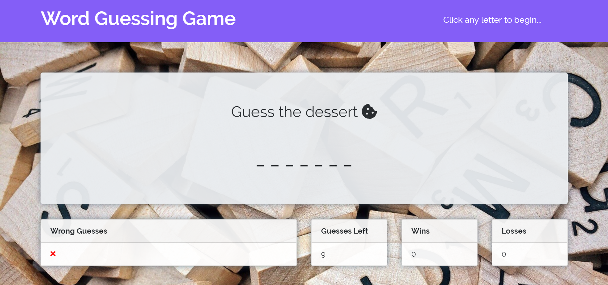
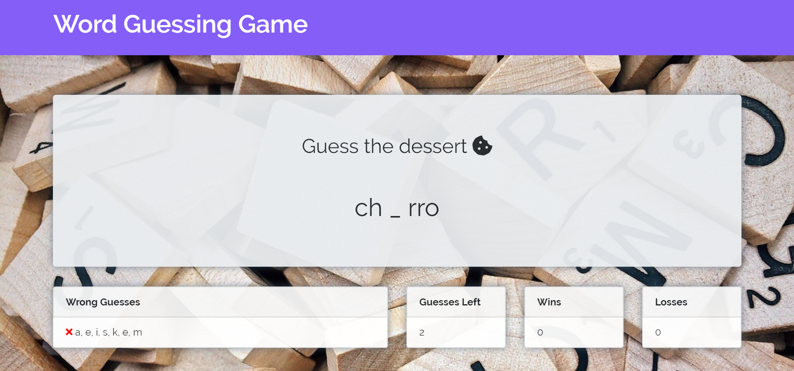
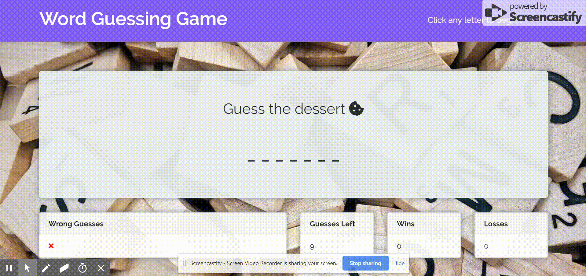

# Word-Guess-Game

# Project Description

This project is a word guessing game in the style of hangman. The user tries to guess the word by guessing different letters, which then appear in the appropriate spaces of the word as the user guesses correct words. The user has nine tries to guess the word. A counter keeps track of how many guesses the user has left. When the user correctly guesses the word, the user gets a "win" added to his or her score (otherwise, the use gets a "loss" added to the score).

This project is heavy in JavaScript, but it also uses HTML and CSS, including Bootstrap. The font used in the "win" and "loss" messages come from Google Fonts. The favicon used on the tab is from Font Awesome. As an added bonus, a fanfare sound plays when the user guesses the word correctly, and a sad trombone sound plays when the user loses. These are MP3 files added in a separate "sounds" folder inside the "assets" directory.

# Technologies Used

* JavaScript
* Bootstrap
* CSS
* HTML

# Word Guess Game Live Link

Please check out the live link for Word Guess Game here:

https://answebdev.github.io/Word-Guess-Game/

# Screenshots

